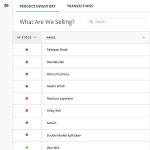

# Domo Apps Sample App
[](http://commitizen.github.io/cz-cli/)



## What is the Sample App?
This app was created to demonstrate how to use the Domo Apps [Starter Kit](https://github.com/DomoApps/starter-kit) and how commonly requested functionality is implemented in a Domo App

Because this app is not attached to an instance of Domo, DataSource requests are mocked in the products and transaction analytics factories. Comments are included to explain how production DataSource requests are made. See the [Domo Developer Guide](https://developer.domo.com/docs/dev-studio/dev-studio-data) for more information on DataSource requests.

## Getting Started
1. Clone this repo
    `$ git clone {URL}`
2. Install dependencies `$ npm install`
3. Run local server `$ npm start`

## Uploading to Domo
1. Login to Domo `$ domo login`
2. Publish sample app `$ npm run upload`
3. Update the `{ id: ... }` value in `domo/manifest.json` with your new app id

## All npm Commands
- `$ npm start` to run webpack-dev-server
- `$ npm test` to run unit tests
- `$ npm run tdd` to continuously run tests
- `$ npm run eslint` to lint code
- `$ npm run build` to build (and minify)
- `$ npm version (patch|minor|major)` to create git release
- `$ npm run upload` to upload new version to domo. aka `domo publish`
- `$ npm run update-tools` to pull in improvements to the dev tools


## Technologies
- [webpack](http://webpack.github.io/)
- [ES2015 via Babel](https://babeljs.io/docs/learn-es2015/)
- [postcss & precss](https://github.com/jonathantneal/precss)
- [angular 1.x](https://angularjs.org/)

## Features
- Code Linting
  + [eslint]() - For JavaScript
- Dev Server with auto-reload
  + [webpack-dev-server](http://webpack.github.io/docs/webpack-dev-server.html)
  + Proxy for data service
- Changelog Generation
  + [conventional-changelog](https://github.com/ajoslin/conventional-changelog)
- Minification
  + [UglifyJS2](https://github.com/mishoo/UglifyJS2)
- Git Release Automation
- [.editorconfig](http://editorconfig.org/)
- Plop
  + $ plop [type e.g. directive, factory, filter, route]
  + [da-plop](https://git.empdev.domo.com/AppTeam6/da-plop)
- Unit Testing Framework
  + [karma](http://karma-runner.github.io/): Test Runner
  + [mocha](https://mochajs.org/)
  + [chai](http://chaijs.com/)

## Folder Structure
```text
. // top level config stuff for webpack, karma, eslint, ect...
├── src
|    ├── common // common across desktop and mobile
|    |    ├── components // place for common components
|    |    |
|    |    ├── filters // place for common filters
|    |    |
|    |    ├── services // place for common services
|    |    |
|    |    ├── styles // place for common styles
|    |    |    ├── typebase.css // base type for all apps
|    |    |    └── variable.css // variables
|    |    └── index.js // JS entry for common Angular module
|    |
|    ├── desktop // a folder for each component
|    |    ├── components // place for dumb/presenter components common across routes
|    |    |
|    |    ├── containers // place for smart/container components common across routes
|    |    |
|    |    ├── routes // place for routes
|    |    |    └── my-route
|    |    |        ├── components // place for dumb/presenter components specific to this route
|    |    |        |
|    |    |        ├── containers // place for smart/container components specific to this route
|    |    |        |    └── my-container
|    |    |        |        ├── my-container.component.js
|    |    |        |        ├── my-container.component.css
|    |    |        |        └── my-container.component.html
|    |    |        |
|    |    |        └── index.js // define module and route
|    |    |
|    |    ├── desktop.cofig.js // desktop app top level configuration
|    |    ├── desktop.init.js // top level initialization code
|    |    ├── desktop.html // html entry (layout html goes here)
|    |    ├── desktop.css // common css for desktop
|    |    └── index.js // JS entry
|    |
|    └── mobile // same structure as desktop
|
└── dist // Generated by build
...

```
